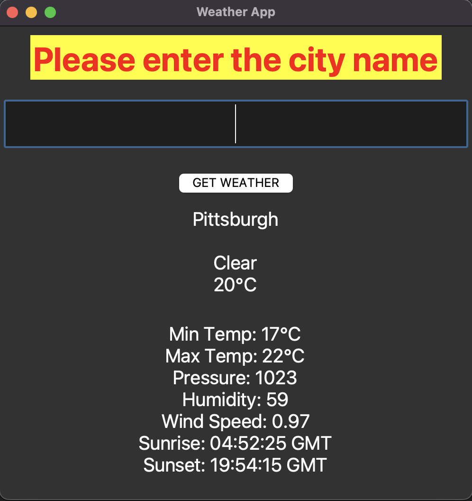
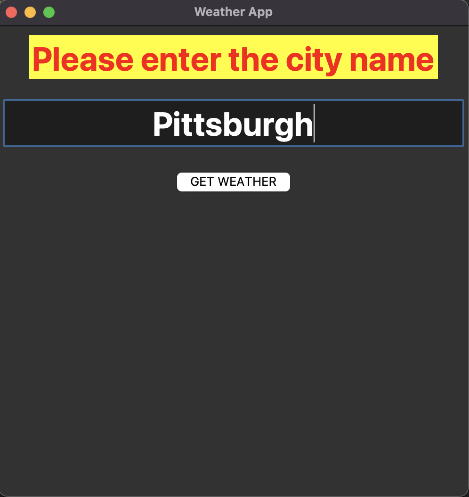

# WeatherInfoGUI
## This is a GUI application that shows the weather details of a city using python OpenWeather API. 
Author: Enliang Wu 
Ref: evanemran

Before running the application, please install the required packages.

### API info
OpenWeather API url: https://openweathermap.org/api  
Current Weather Data

## Sample output

Ask the user to enter the city name

Showing the weather information of the city

